# PRACTICA 2. DOCKER - DOCKER COMPOSE.
#### Vicente Andani Auñón


## ¿Qué es Docker?

Docker es una plataforma de software que le permite crear, probar e implementar aplicaciones rápidamente. Docker empaqueta software en unidades estandarizadas llamadas contenedores que incluyen todo lo necesario para que el software se ejecute. Utilizando Docker evitamos la sobrecarga de iniciar y mantener máquinas virtuales.

Docker permite entregar código con mayor rapidez, estandarizar las operaciones de las aplicaciones, transferir el código con facilidad y ahorrar dinero al mejorar el uso de recursos. Con Docker, se obtiene un solo objeto que se puede ejecutar de manera fiable en cualquier lugar.

### Como instalar Docker en Ubuntu

Para instalar Docker tendremos que ejecutar los siguientes comandos en nuestra terminal:

```
sudo apt update

sudo apt install apt-transport-https ca-certificates curl software-properties-common

curl -fsSL https://download.docker.com/linux/ubuntu/gpg | sudo apt-key add -

sudo add-apt-repository "deb [arch=amd64] https://download.docker.com/linux/ubuntu bionic stable"

apt-cache policy docker-ce

sudo apt install docker-ce

sudo systemctl status docker
```

## ¿Qué es Docker Compose?

Docker Compose es una herramienta que permite simplificar el uso de Docker.
Con Compose se puede crear diferentes contenedores, diferentes servicios, unirlos a un volumen común, iniciarlos y apagarlos, etc. Es un componente fundamental para poder construir aplicaciones y microservicios.

Docker Compose te permite mediante archivos YAML instruir al Docker Engine a realizar tareas, programáticamente.

### Como instalar Docker-Compose en Ubuntu

Para instalar Docker-Compose tendremos que ejecutar los siguientes comandos en nuestra terminal:

```
sudo apt update

sudo curl -L "https://github.com/docker/compose/releases/download/1.26.0/docker-compose-$(uname -s)-$(uname -m)" -o /usr/local/bin/docker-compose

sudo chmod +x /usr/local/bin/docker-compose
```

## Introducción a la práctica

En esta práctica aprenderemos el funcionamiento de Docker junto a Docker Compose. Tendremos que realizar un archivo Docker Compose que contendrá 3 servicios (la aplicación, Prometheus y Grafana) conectados entre si, en ese archivo docker compose también utilizaremos un DockerFile. Finalmente intentaremos implementar la práctica en un proyecto más grande.

## Aplicación

Primero vamos a proceder a realizar un contendedor que se encargará de poner en funcionamiento un servidor express. Para ello tenemos que realizar un Dockerfile.

He movido los archivos del servidor a la carpeta src.

### Creación del dockerignore.

Antes de realizar el Dockerfile es recomendable crear un dockerignore para evitar que archivos/carpetas innecesarias se pasen al contenedor, en mi caso voy a introducir en el dockerignore la carpeta node_modules (ya que en el servidor ya instalaremos los paquetes necesarios.)

Para ello creamos un fichero con el nombre *.dockerignore* y añadimos *node_modules*

### Creación del Dockerfile.

Ahora vamos a empezar creando el Dockerfile de la siguiente forma.
```
FROM node:alpine3.10
RUN mkdir myapp
WORKDIR /myapp
COPY ./src .
RUN npm install
EXPOSE 3000
CMD ["node", "app.js"]
```

Primero obtenemos la imagen alpine3.10 de Node. Ahora tenemos que indicar la ruta donde estará nuestra aplicación funcionando, en mi caso creo una carpeta llamada "myapp" y establezco el directorio de trabajo a esa misma carpeta.

Copiamos el contenido de la carpeta local src (donde tenemos el servidor) al directorio de trabajo actual, esto copiara los archivos de dentro de SRC a la carpeta myapp de nuestro contenedor.

Ahora vamos a instalar los paquetes necesarios para el funcionamiento del servidor, en el Dockerfile indicamos que realice un NPM INSTALL en el directorio donde tenemos el packages.json.

Tenemos que exponer el puerto 3000 para después poder vincularlo con uno de nuestra máquina real.

Finalmente le indicamos al Dockerfile que ejecute el servidor con node app.js, esto dejará abierto el servidor en el contenedor.


### Test Dockerfile
Una vez finalizado el Dockerfile recomiendo probarlo realizando un build y viendo que podemos acceder.

```
docker build . --tag myapp
```
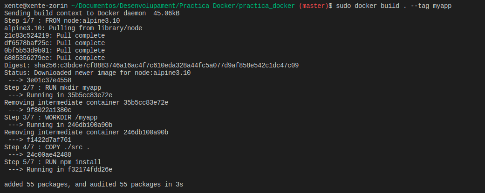

Ahora comprobamos que la imagen se ha creado correctamente

```
docker images
```
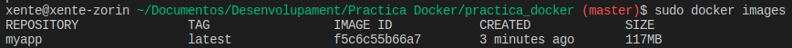

Vamos a crear un contenedor con esa imagen, simplemente para probar que funciona correctamente antes de realizar el archivo docker-compose.

```
sudo docker run -d -p 9001:3000 --name myapp myapp
```
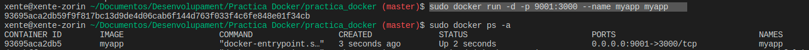

Y si vamos al navegador por el puerto indicado podremos acceder a la web que esta sirviendo el servidor express en el contenedor creado.

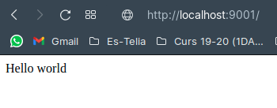


## Crear el Docker Compose 

Vamos a crear un archivo *docker-compose.yml* en el cual iniciaremos tres servicios, el primero será la Aplicación con su dockerfile, después el prometheus para recoger métricas en tiempo real y el Grafana para crear gráficas obtenidas desde el prometheus.

Primero vamos a añadir el servicio que se encargará de crear el contenedor con el Dockerfile anteriormente creado.

Quedará asi:

```
version: '3'
services:
  myapp_practica:
    build: .
    container_name: myapp_practica
    networks:
    - network_practica
    ports:
    - '83:3000'
networks:
  network_practica:
```

Con el parámetro build indicamos que tiene que partir de un Dockerfile, al estar en la misma ubicación se pone un punto.
A continuación, le asignamos el nombre de contenedor, y creamos la network que utilizarán los tres servicios. Posteriormente, asignamos el puerto 83 de nuestro ordenador al 3000 del contenedor.

### Prometheus

Prometheus es una aplicación que nos permite recoger métricas de una aplicación en tiempo real.

Ahora vamos a crear el servicio que se encargará de montar el contendor del prometheus

El *docker-compose.yml* quedará así:

```
version: '3'
services:
  myapp_practica:
    build: .
    container_name: myapp_practica
    networks:
    - network_practica
    ports:
    - '83:3000'
  prometheus:
    image: prom/prometheus:v2.20.1
    container_name: prometheus_practica
    networks:
    - network_practica
    ports:
    - "9090:9090"
    volumes:
    - ./prometheus.yml:/etc/prometheus/prometheus.yml
    command:
    - --config.file=/etc/prometheus/prometheus.yml
    depends_on:
    - myapp_practica
networks:
  network_practica:
```

Partimos de la imagen *prom/prometheus:v2.20.1*, al contenedor le asignaremos el nombre *prometheus_practica* y le asignamos la network *network_practica*.

Le asignamos el puerto 9090 y copiamos la configuración a la ruta */etc/prometheus/*, le indicamos que ejecute el siguiente comando para que cargue la configuración previamente copiada: *--config.file=/etc/prometheus/prometheus.yml*.

Finalmente, indicamos que dependa del servicio *myapp_practica* para que se inicie cuando este servicio se haya iniciado.


### Grafana

Grafana es un servicio que se encarga de graficar las métricas creadas por Prometheus.

El *docker-compose.yml* quedará así:

```
version: '3'
services:
  myapp_practica:
    build: .
    container_name: myapp_practica
    networks:
    - network_practica
    ports:
    - '83:3000'
  prometheus:
    image: prom/prometheus:v2.20.1
    container_name: prometheus_practica
    networks:
    - network_practica
    ports:
    - "9090:9090"
    volumes:
    - ./prometheus.yml:/etc/prometheus/prometheus.yml
    command:
    - --config.file=/etc/prometheus/prometheus.yml
    depends_on:
    - myapp_practica
  grafana:
    image: grafana/grafana:7.1.5
    container_name: grafana_practica
    networks:
    - network_practica
    ports:
    - "3500:3000"
    volumes:
    - ./datasources.yml:/etc/grafana/provisioning/datasources/datasources.yml
    - myGrafanaVol:/var/lib/grafana
    environment:
      GF_AUTH_DISABLE_LOGIN_FORM: "true"
      GF_AUTH_ANONYMOUS_ENABLED: "true"
      GF_AUTH_ANONYMOUS_ORG_ROLE: Admin
      GF_INSTALL_PLUGINS: grafana-clock-panel 1.0.1
    depends_on:
    - prometheus
volumes:
  myGrafanaVol:
networks:
  network_practica:
```

Partimos de la imagen *grafana/grafana:7.1.5*, al contenedor le asignaremos el nombre *grafana_practica* y le asignamos la network *network_practica*.

Le asignamos el puerto 3500 (ya que el 3000 lo tenemos en uso) y copiamos datasources a la ruta */etc/grafana/provisioning/datasources*, creamos un nuevo volumen llamado *myGrafanaVol* y lo asignamos a */var/lib/grafana*.

Ahora vamos a establecer las variables de entorno:

- *GF_AUTH_DISABLE_LOGIN_FORM: "true"* esta variable sirve para deshabilitar el login,
- *GF_AUTH_ANONYMOUS_ENABLED: "true"* con esta habilitamos el usuario Anónimo,
- *GF_AUTH_ANONYMOUS_ORG_ROLE: Admin* para cambiar el rol del usuario Anónimo a Admin,
- *GF_INSTALL_PLUGINS: grafana-clock-panel 1.0.1* e instalamos el siguiente plugin.

Finalmente indicamos que dependa del servicio Prometheus para que se inicie después que este.

## Ejecutar el Docker Compose 

Una vez creado el Docker Compose vamos a proceder a ejecutarlo, para ello ejecutamos el siguiente comando:

```
docker-compose up
```
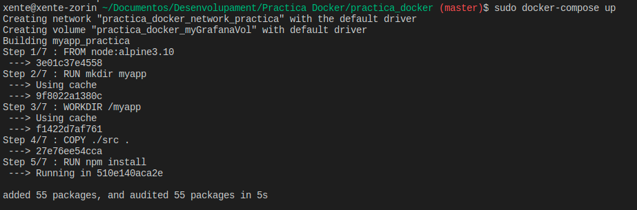
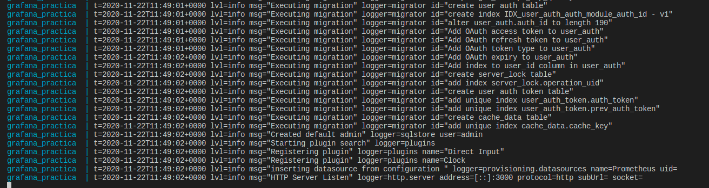

Ahora vamos al navegador y comprobamos las siguientes rutas:

```
localhost:83
```
Aquí podremos ver la app funcionando correctamente.


```
localhost:9090
```

Aquí nos dirigiremos al apartado Status/Targets y veremos que se muestra el acceso correcto a las métricas capturadas de la app.

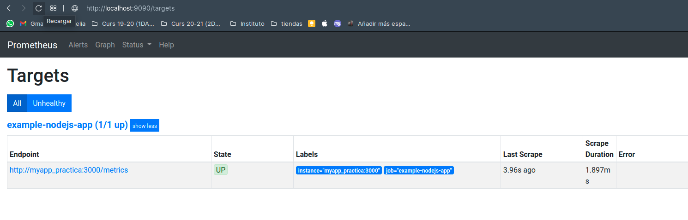

```
localhost:3500
```

Aquí podremos añadir paneles y gráficas de nuestra aplicación.

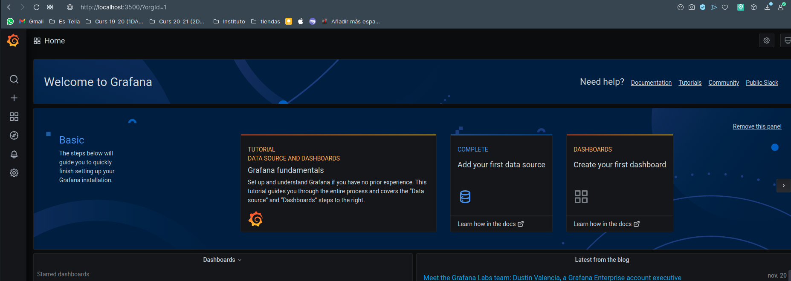

### Crear panel asociado a los endpoints con Grafana.

Dentro de Grafana (*localhost:3500*) nos dirigimos a Create ->  Dashboard

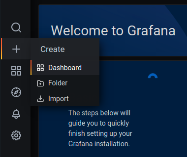

Seguidamente presionamos en añadir nuevo panel, y vamos a proceder a crear un panel con cada endpoint y después creamos un panel con la suma de las visitas de los dos endpoints.

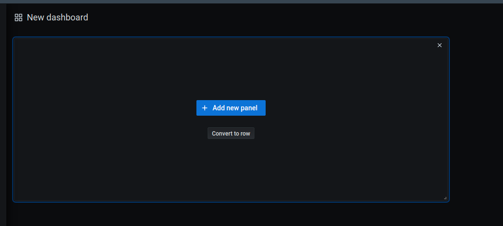

Para crear un panel con los dos endpoints nos dirigimos a Metrics y seleccionamos los endpoints.

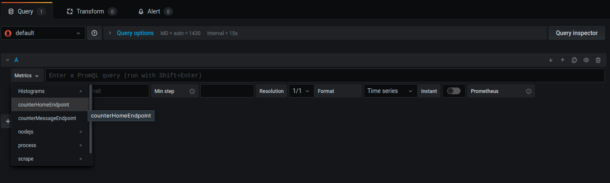

Tiene que quedar algo así:

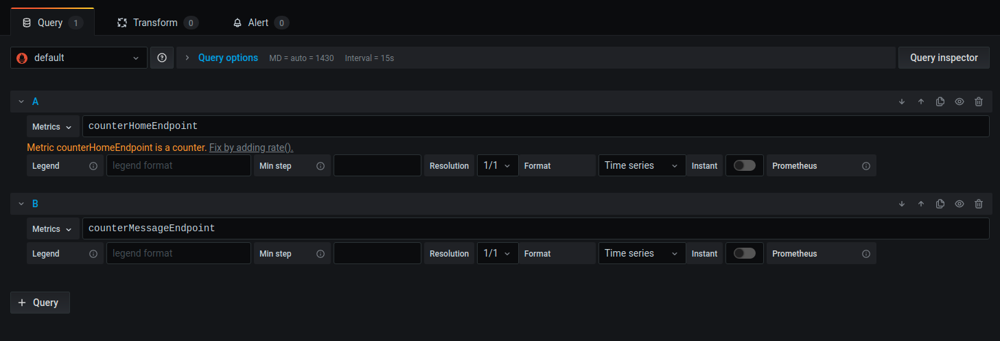

Le damos a aplicar.

Ahora vamos a crear el siguiente panel (suma de todos los endpoints), repetimos el proceso anterior, pero en Metrics introducimos lo siguiente:

```
sum(counterHomeEndpoint+counterMessageEndpoint)
```

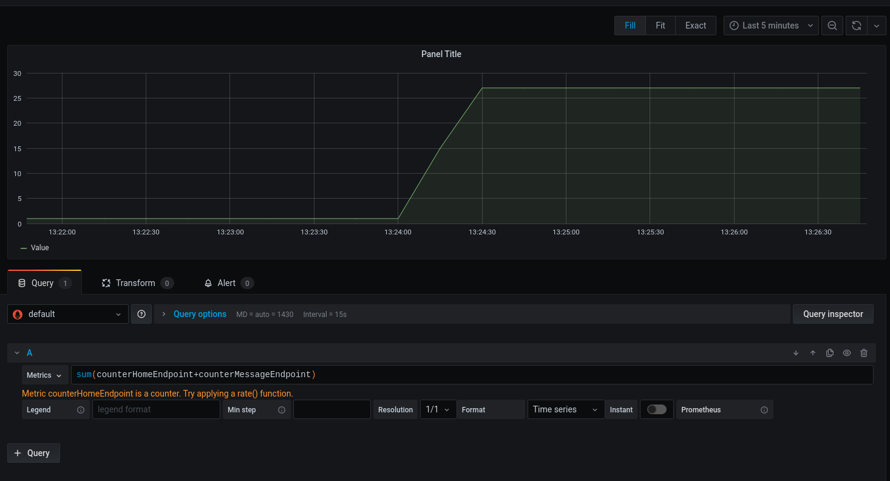

Y en el apartado Visualization seleccionamos el siguiente tema:

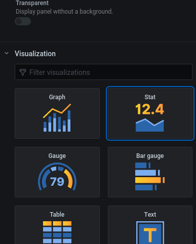

Aplciamos y guardamos el Dashboard:


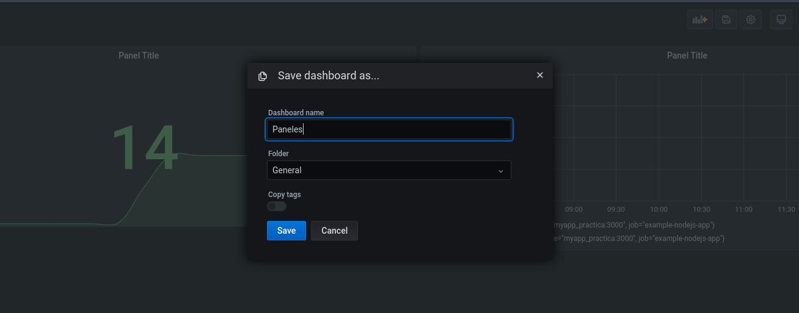

Ahora podemos hacer unas cuantas visitas a los endpoints (*localhost:83* y *localhost:83/message*) y ver las gráficas:

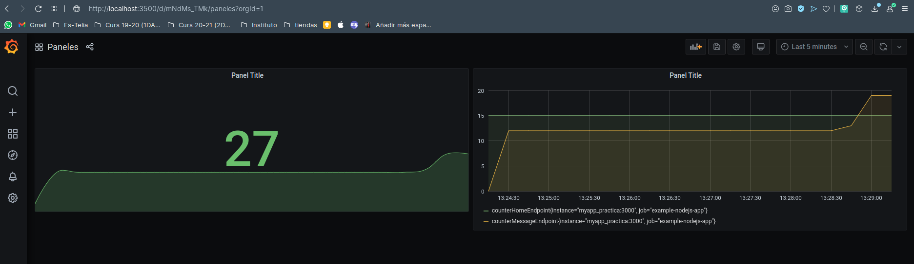

## Integración en Yuker

Yuker es el proyecto que yo he realizado con Yolanda, trata de una aplicacion donde los usuarios pueden dejar preguntas y otros pueden responderlas. 
Es un proyecto con dos backends (rest y graphql) y un frontend (angularjs). 

Ahora vamos a integrar Prometheus y Grafana en él. Aquí bajo adjunto el enlace del repositorio para poder ver el código con mayor claridad.

Proyecto: [YUKER](https://github.com/vicnx/Yuker).

### Docker-Compose de la aplicación

Primero tenemos que realizar el Docker-compose de los backends de la aplicación. 

Creamos el fichero docker-compose.yml en la carpeta backend.

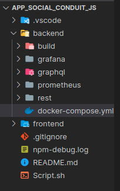

En el docker compose tendremos que añadir 3 servicios, uno para la api rest otro para graphql y el último para mongo. (más tarde añadiremos el prometheus y el grafana)
```
version: "3"
services:
 yuker_rest:
  image: mhart/alpine-node:8
  container_name: yuker_rest
  restart: on-failure
  working_dir: /yuker
  command: npm start
  ports:
   - "3000:3000"
  volumes:
   - ./rest:/yuker
  links: 
   - mongo
  depends_on:
   - mongo
  networks:
   - network_yuker
 yuker_graphql:
  image: mhart/alpine-node:8
  container_name: yuker_graphql
  restart: on-failure
  working_dir: /yuker
  command: npm start
  ports:
   - "3001:3001"
  volumes:
   - ./graphql:/yuker
  links: 
   - 'mongo'
  depends_on:
   - 'mongo'
  networks:
   - network_yuker
 mongo:
  image: mvertes/alpine-mongo
  container_name: mongo_yuker
  ports:
   - "27018:27017"
  volumes:
   - /data/db
  networks:
   - network_yuker
networks:
  network_yuker:
```

Antes de probar el docker compose, tendremos que cambiar unas rutas en nuestra aplicación. Nos dirigimos a *backend/rest/app.js* y localizamos la siguiente línea:
```
mongoose.connect('mongodb://localhost/app_social_conduit_js');
```
La reemplazamos por la siguiente:

```
mongoose.connect('mongodb://mongo:27017/app_social_conduit_js');
```

Ahora vamos a *backend/graphql/app.js* y realizamos el mismo proceso.

Esto se encarga de apuntar al contenedor con ese nombre **mongo**.

Ahora que ya tenemos listo el docker-compose de los backends de la aplicación, podemos implementar el **prometheus** y el **grafana**.

### Prometheus

#### Configuración

Antes de nada tendremos que crear en nuestra carpeta *backend* una carpeta llamada **Prometheus**, donde estará la configuración.

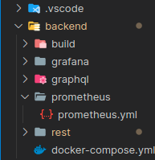

**prometheus.yml**
```
global:
  scrape_interval: 5s
  evaluation_interval: 30s
scrape_configs:
  - job_name: "example-nodejs-app"
    honor_labels: true
    static_configs:
      - targets: ["yuker_rest:3000"]
```

En el campo targets introducimos el nombre de nuestro servicio de api rest.

#### Docker-Compose

En nuestro **docker-compose.yml** añadimos lo siguiente:

```
 prometheus:
  image: prom/prometheus:v2.20.1
  container_name: prometheus_yuker
  volumes:
  - ./prometheus/:/etc/prometheus
  ports:
  - "9090:9090"
  depends_on:
  - yuker_rest
  links:
  - yuker_rest
  command: ["--config.file=/etc/prometheus/prometheus.yml"]
  networks:
  - network_yuker
```

#### Nuevos Paquetes

Seguidamente tendremos que instalar dos paquetes nuevos en nuestra aplicación para que funcione correctamente.

En la ruta *backend/rest/* instalamos los siguientes paquetes:
```
npm install prom-client
```
```
npm install response-time
```

#### Endpoints

Vamos a crear un endpoint para probar el funcionamiento más adelante.

Nos dirigimos a *backend/rest/routes/api/yuks.js*

Y vamos a añadir el siguiente código justo al principio para crear un contador.

```
let client = require('prom-client');

const collectDefaultMetrics = client.collectDefaultMetrics;
collectDefaultMetrics({ timeout: 5000 });

const counterYuksEndpoint = new client.Counter({
  name: 'counterYuksEndpoint',
  help: 'The total number of processed requests to get endpoint'
});
```

Ahora localizamos la siguiente línea:

```
router.get('/', auth.optional, function(req, res, next) {
```

y justo bajo añadimos el incrementador:

```
counterYuksEndpoint.inc();
```

Cada vez que alguien entre a la ruta *http://localhost:3000/api/yuks* se sumará uno en ese contador.

#### Metrics

Ahora vamos a crear una nueva ruta en nuestra aplicación para poder visualizar las métricas:

Vamos a la ruta *backend/rest/routes/index.js* y dentro añadimos la nueva ruta.

```
router.use('/metrics', require('./metrics'));
```

Ahora si iniciamos el docker-compose podremos comprobar que si nos dirigimos a la ruta *localhost/3000/metrics* nos aparecen las métricas.

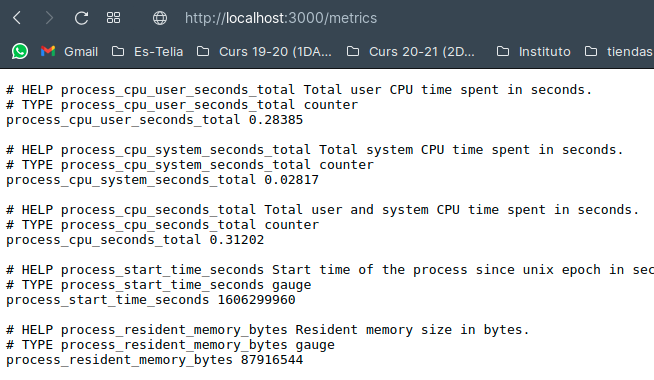

Y al final tendremos el endpoint:

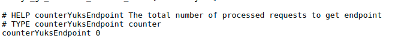

#### Comprobación

Para comprobar que Prometheus funciona correctamente, iniciamos el docker-compose y nos dirigimos a *http://localhost:9090*.

Y vamos a Status -> Targets

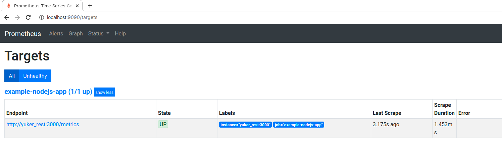

### Grafana en Yuker

#### Configuración

Una vez montado *Prometheus* vamos a empezar con *Grafana*.

Creamos una carpeta llamada Grafana en */backend/* dentro creamos un archivo llamado **datasources.yml**.

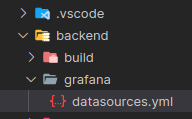

**datasources.yml**
```
apiVersion: 1
datasources:
  - name: Prometheus
    type: prometheus
    access: proxy
    orgId: 1
    url: prometheus_yuker:9090
    basicAuth: false
    isDefault: true
    editable: true
```

En el campo *url* introducimos el nombre del servicio *Prometheus* anteriormente creado junto con su puerto.

#### Docker-Compose

En nuestro **docker-compose.yml** añadimos el servicio **Grafana**.

```
 grafana:
  image: grafana/grafana:7.1.5
  container_name: grafana_yuker
  environment:
   - GF_DISABLE_LOGIN_FORM=true
   - GF_AUTH_ANONYMOUS_ORG_ROLE=Admin
   - GF_AUTH_ANONYMOUS_ENABLED=true
   - GF_INSTALL_PLUGINS=grafana-clock-panel 1.0.1
  volumes:
   - myGrafanaVol:/var/lib/grafana
   - ./grafana/:/etc/grafana/provisioning/datasources/
  ports:
   - "3500:3000"
  depends_on:
   - prometheus
  links:
   - prometheus   
  networks:
   - network_yuker
```

y el volumen que usará

```
volumes:
  myGrafanaVol: {}
```

#### Comprobaciones

Ejecutamos el docker-compose y nos dirigimos a la ruta *http://localhost:3500*, ahi veremos el Grafana funcionando. 

Ahora vamos a crear un panel con el endpoint.

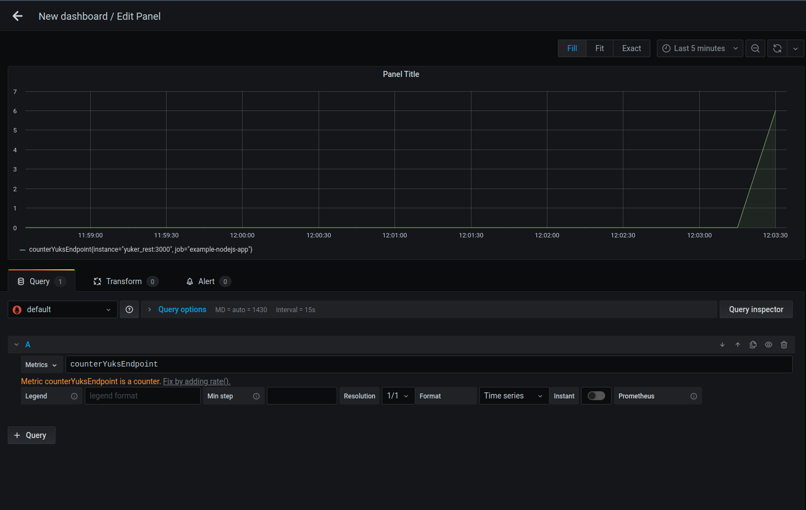

### Resultado

Proyecto: [YUKER](https://github.com/vicnx/Yuker).

**docker-compose.yml**
```
version: "3"
services:
 yuker_rest:
  image: mhart/alpine-node:8
  container_name: yuker_rest
  restart: on-failure
  working_dir: /yuker
  command: npm start
  ports:
   - "3000:3000"
  volumes:
   - ./rest:/yuker
  links: 
   - mongo
  depends_on:
   - mongo
  networks:
   - network_yuker
 yuker_graphql:
  image: mhart/alpine-node:8
  container_name: yuker_graphql
  restart: on-failure
  working_dir: /yuker
  command: npm start
  ports:
   - "3001:3001"
  volumes:
   - ./graphql:/yuker
  links: 
   - 'mongo'
  depends_on:
   - 'mongo'
  networks:
   - network_yuker
 prometheus:
  image: prom/prometheus:v2.20.1
  container_name: prometheus_yuker
  volumes:
  - ./prometheus/:/etc/prometheus
  ports:
  - "9090:9090"
  depends_on:
  - yuker_rest
  links:
  - yuker_rest
  command: ["--config.file=/etc/prometheus/prometheus.yml"]
  networks:
  - network_yuker
 mongo:
  image: mvertes/alpine-mongo
  container_name: mongo_yuker
  ports:
   - "27018:27017"
  volumes:
   - /data/db
  networks:
   - network_yuker
 grafana:
  image: grafana/grafana:7.1.5
  container_name: grafana_yuker
  environment:
   - GF_DISABLE_LOGIN_FORM=true
   - GF_AUTH_ANONYMOUS_ORG_ROLE=Admin
   - GF_AUTH_ANONYMOUS_ENABLED=true
   - GF_INSTALL_PLUGINS=grafana-clock-panel 1.0.1
  volumes:
   - myGrafanaVol:/var/lib/grafana
   - ./grafana/:/etc/grafana/provisioning/datasources/
  ports:
   - "3500:3000"
  depends_on:
   - prometheus
  links:
   - prometheus   
  networks:
   - network_yuker
volumes:
  myGrafanaVol: {}
networks:
  network_yuker:
```
Panel en Grafana

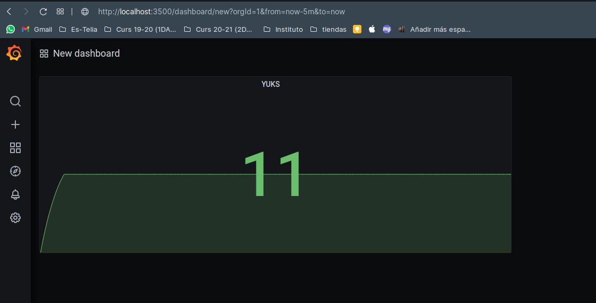


